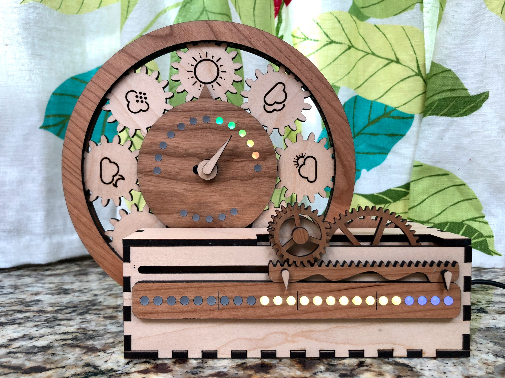

I’m starting a new blog!

I wanted to write about some of the crafting and making projects that I’ve been
doing, and I didn’t want to just publish to Medium or other places that I didn’t
control.

And, while Blogger still exists (for now?) I thought it would be fun to roll my
own a bit more.

This site is built with [Gatsby](https://www.gatsbyjs.org/) and hosted on
[Netlify](https://www.netlify.com/). I’m using a private GitHub repo for the
content backend, though I’m publishing the theme source in my
[fionawhim-gatsby-themes](https://github.com/fionawhim/fionawhim-gatsby-themes)
repo.

